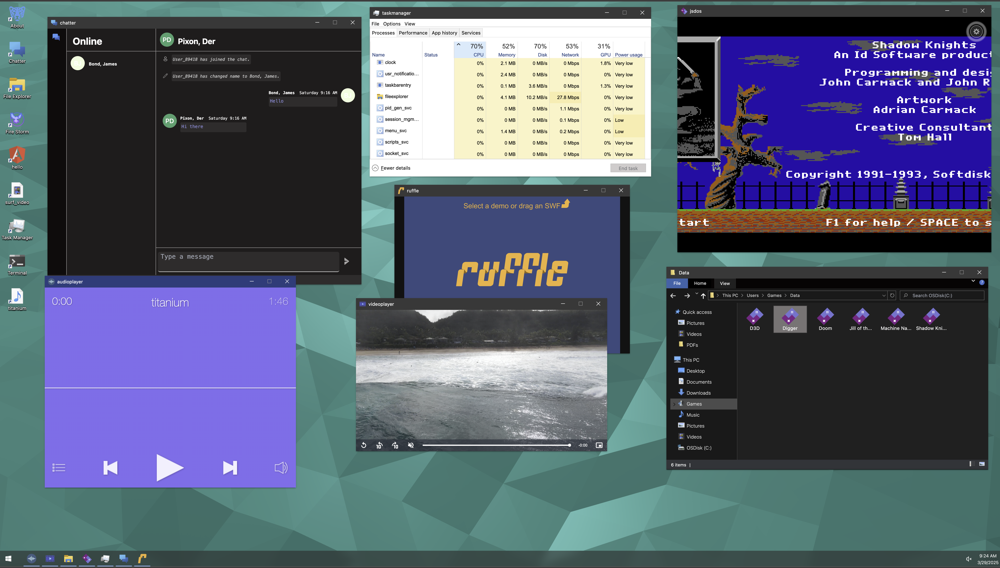

# CheetahOs

Building a Dektop environment in the web browser

This project was generated with [Angular CLI](https://github.com/angular/angular-cli) version 18.0.0.

## Development server

Run `ng serve` for a dev server. Navigate to `http://localhost:4200/`. The application will automatically reload if you change any of the source files.

## Code setup

Run `ng generate component component-name` to generate a new component. You can also use `ng generate directive|pipe|service|class|guard|interface|enum|module`.

Run `npm run build` to generate the filesystem(osdrive.json). Once the filesystem is created, update the file by placing all the auto generated content within the tag {"osdrive": .................}.

It should look like this {"osdrive":{"Desktop":{"audioplayer.url":null,"fileexplorer.url":null,"heat.url":null,"hello.url":null,"taskmanager.url":null,"terminal.url":null,"videoplayer.url":null}}}

***Note - npm will throw an error that it is unable to find make_http_index.js. All you have to do, is to got `CheetahOs/node_modules/browserfs/dist/scripts folder` and make a copy of `make_xhrfs_index.js` and rename it to `make_http_index.js`

***Note Some other error might occur in browserfs as a result of missing libs.

We are not utilizing the DropBox feature, so we can comment it out
comment out this line `/// <reference types="dropboxjs" />` change it to `/* /// <reference types="dropboxjs" />*/`

|---> Cannot find namespace `Dropbox`: replace reference to `Dropbox` with `any`. like `client: Dropbox.Client; --> client: any;`

|---> Cannot find namespace `NodeBuffer` : replace reference to `NodeBuffer` with `any`. like `client: buffer: NodeBuffer; --> buffer: any;`

|---> Property `put` in type `IndexedDBRWTransaction` is not assignable to the same property in base type 'AsyncKeyValueRWTransaction'.

 |---> change `(key: string, data: Buffer, overwrite: boolean, cb: BFSCallback<boolean>)`  to `(key: string, data: Buffer, overwrite: boolean, cb: any)`

|---> Type `Stats` is missing the following properties from type `StatsBase<number>: atimeMs, mtimeMs, ctimeMs, birthtimeMs`

 |---> add this line of code:`atimeMs: number; mtimeMs: number; ctimeMs: number; birthtimeMs: number;`

## Code scaffolding
## Build

Run `ng build` to build the project. The build artifacts will be stored in the `dist/` directory.

## Running unit tests

Run `ng test` to execute the unit tests via [Karma](https://karma-runner.github.io).

## Running end-to-end tests

Run `ng e2e` to execute the end-to-end tests via a platform of your choice. To use this command, you need to first add a package that implements end-to-end testing capabilities.

## Further help

To get more help on the Angular CLI use `ng help` or go check out the [Angular CLI Overview and Command Reference](https://angular.io/cli) page.
